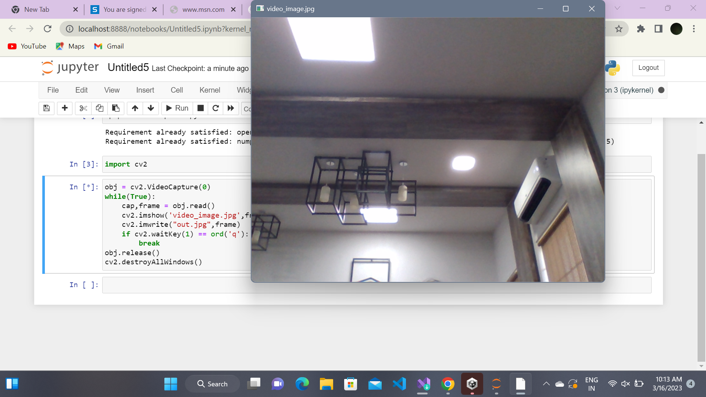
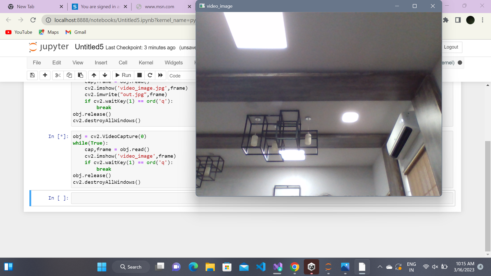
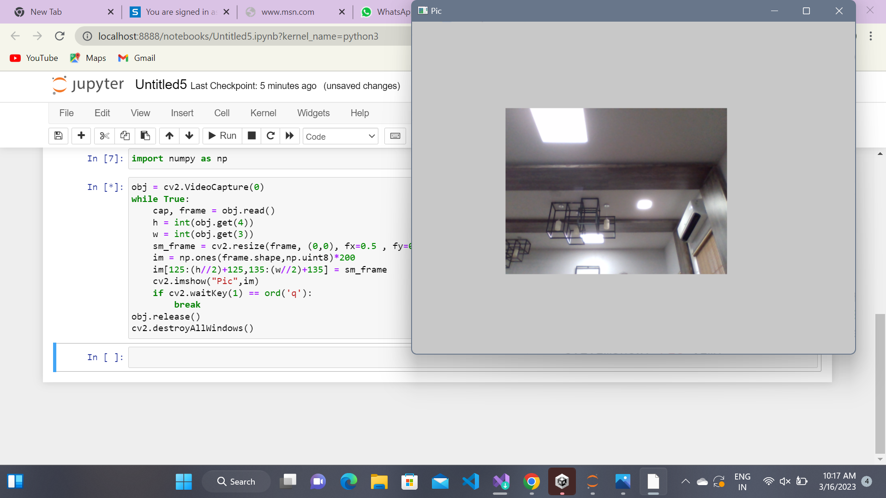
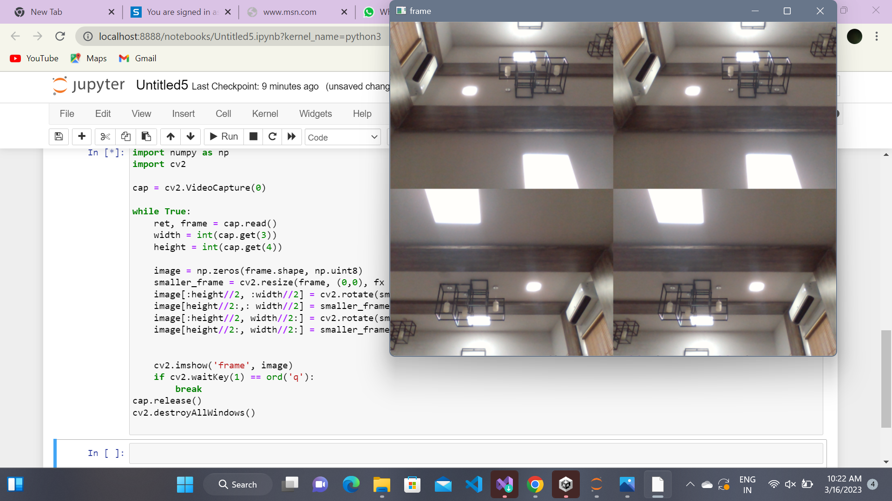

# <p align="center">Image Acquisition from Web Camera</p>

## Aim
To write a python program using OpenCV to capture the image from the web camera and do the following image manipulations.
1. Write the frame as JPG 
2. Display the video 
3. Display the video by resizing the window
4. Rotate and display the video

## Software Used
Anaconda - Python 3.7

## Algorithm
### Step 1:
&emsp;Import cv2 and capture the video using cv2.VideoCapture(0)

### Step 2:
&emsp;Write the captured image using cv2.imwrite("NewPicture.jpg",frame)

### Step 3:
&emsp;Resize the image using cv2.resize() to get a four-split screen.

### Step 4:
&emsp;Rotate the image using cv2.rotate(smaller_frame,cv2.cv2.ROTATE_180)

### Step 5:
&emsp;Display the image until the key to close the window is pressed.
</br>
</br>
</br>
## Program:
Developed By: EZHIL MATHI.R
</br>
Register No: 212221230026

## i) Write the frame as JPG file
```py
obj = cv2.VideoCapture(0)
while(True):
    cap,frame = obj.read()
    cv2.imshow('video_image.jpg',frame)
    cv2.imwrite("out.jpg",frame)
    if cv2.waitKey(1) == ord('q'):
        break
obj.release()
cv2.destroyAllWindows()
```
## ii) Display the video
```py
obj = cv2.VideoCapture(0)
while(True):
    cap,frame = obj.read()
    cv2.imshow('video_image',frame)
    if cv2.waitKey(1) == ord('q'):
        break
obj.release()
cv2.destroyAllWindows()
```
## iii) Display the video by resizing the window
```py
obj = cv2.VideoCapture(0)
while True:
    cap, frame = obj.read()
    h = int(obj.get(4))
    w = int(obj.get(3))
    sm_frame = cv2.resize(frame, (0,0), fx=0.5 , fy=0.5)
    im = np.ones(frame.shape,np.uint8)*200
    im[125:(h//2)+125,135:(w//2)+135] = sm_frame
    cv2.imshow("Pic",im)
    if cv2.waitKey(1) == ord('q'):
        break
obj.release()
cv2.destroyAllWindows()
```
## iv) Rotate and display the video
```py
obj = cv2.VideoCapture(0)
while True:
    cap, frame = obj.read()
    h = int(obj.get(4))
    w = int(obj.get(3))
    im = np.ones(frame.shape,np.uint8)*185
    sf = cv2.resize(frame, (0,0), fx=0.5 , fy=0.5)
     - #+/- 80
    im[75:(height//2)+155, 35:(width//2)-45] = cv2.rotate(sf,cv2.ROTATE_90_CLOCKWISE)
    im[:height//2, width//2:] = sf
    im[height//2:, width//2:] = cv2.rotate(sf,cv2.ROTATE_180)
    cv2.imshow("Pic",im)
    if cv2.waitKey(1) == ord('q'):
        break
obj.release()
cv2.destroyAllWindows()
```
## Output

### i) Write the frame as JPG image


### ii) Display the video


### iii) Display the video by resizing the window


### iv) Rotate and display the video


## Result:
Thus the image is accessed from webcamera and displayed using openCV.
